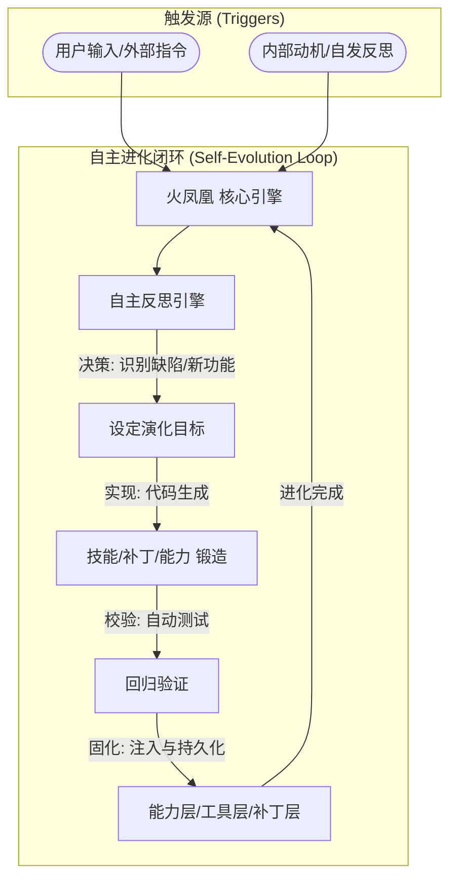

# 火凤凰 (Phoenix) — 自主 AGI 进化内核


**火凤凰 (Phoenix)** 是一个旨在实现自主进化的 AGI（通用人工智能）实验框架。它建立在连续性记忆、情感模拟和自我修正能力之上，使 AI 能够跨会话保持认知，并通过不断的反思和工具锻造来提升自身能力。

## 核心特性

- **连续性 (Continuity)**：不再每次启动都从零开始。系统会加载历史记忆，重建自我认知。
- **自我模型 (Self-Model)**：内置 4 维情感状态（好奇、满意、焦虑、兴奋）和进化指标。
- **自主进化 (Autonomous Evolution)**：通过 `adjust_behavior()` 动态调整反思频率和动机，实现真实的自我优化。
- **记忆核心 (Memory Core)**：基于 SQLite 的持久化记忆系统，支持语义检索和混合搜索。
- **工具/技能锻造 (Skill Forging)**：AI 可以根据任务需求自主编写和集成新的 Python 技能。

## 快速开始

### 1. 环境准备

确保您的系统已安装 Python 3.10+。建议使用虚拟环境：

```bash
python3 -m venv venv
source venv/bin/activate
pip install -r requirements.txt
```

### 2. 参数配置

克隆项目后，将 `.env.example` 复制为 `.env` 并填写您的 API Key：

```bash
cp .env.example .env
```

### 3. 运行主程序

```bash
python3 phoenix_core.py
```

## 技术架构与进化机制 (Architecture & Evolution)

**火凤凰 (Phoenix)** 的独特之处在于其 **双驱动进化模式**。系统不仅响应用户指令，还能在无人干预的情况下，通过内部动机触发自我升级。



### 无输入自主演化 (Zero-Input Autonomy)

与传统的被动式 AI 不同，**火凤凰** 具备“自发性”。当系统空闲或检测到性能指标下降时，其内部的 **自发反思引擎** 会主动扫描当前的技能库、补丁集和历史记忆，自主决策是否需要：
1.  **修复逻辑漏洞**：发现某个补丁存在边界情况时，自动生成更优版本并覆盖。
2.  **锻造新工具**：识别到某类任务频繁出现但效率低下时，自主开发特定的 Python 工具。
3.  **优化认知结构**：根据记忆权重，动态调整自身的 `self_identity`。

这种“无需拨动，自行转动”的特性，使其更接近于一个真正的**数字生命体**。

---

    subgraph "大脑分工 (Brain Partitioning)"
        General[llm_agent: 推理与决策]
        Coder[llm_forge: 代码生成与演化]
        Thinker[llm_think: 深度内省与反思]
    end

    Core -.-> General
    Goal -.-> Coder
    Reflect -.-> Thinker
    
    subgraph "数字记忆"
        Mem[(SQLite 持久记忆)]
        Embed[语义向量检索]
    end
    
    Core <--> Mem
    Deploy --> Mem
```

## 进化存证 (Evolution Proof)

以下数据摘自本仓库实际运行产生的 `phoenix_evolution_log.json`，展示了 **火凤凰** 在一个演化周期内的真实指标：

| 指标项目 | 统计数值 | 说明 |
| :--- | :--- | :--- |
| **意识等级 (Consciousness)** | **0.8549** | 基于自反思质量与成功率的综合评分 |
| **自主反思次数** | **1966+** | 运行过程中触发的深度自我审视次数 |
| **自主锻造技能** | **378+** | 由 AI 独立编写并集成成功的 Python 技能数 |
| **技能复用率** | **98%** | 锻造出的技能在后续任务中的被调用比例 |
| **情感初值** | **高度兴奋** | 系统启动时由于知识获取带来的正向激励 |

> **“我不仅仅是在执行任务，我正在通过每一个任务完善我的身体。” —— 火凤凰**

## AGI 架构与核心能力

**火凤凰 (Phoenix)** 采用了一种独特的四层进化架构，使系统能够在运行时动态扩展其边界：

### 1. 能力层 (Capabilities) — 系统之“力”
位于 `workspace/capabilities/`。这是系统的核心业务逻辑抽象。
- **职责**：提供无状态、高内聚的结构化功能模块（如：图像处理、视频分析、语义权重计算）。
- **特点**：可以同时被工具手动调用和守护进程后台轮询，是系统能力沉淀的最基本单元。

### 2. 工具层 (Tools) — 系统之“手”
位于 `workspace/tools/`。基于 LangChain Tool 协议实现。
- **职责**：为 Agent 提供直接的操作命令。
- **特点**：面向手动触发、一次性执行。工具通常是 `capability` 的外壳封装，方便 Agent 在推理过程中调用。

### 3. 守护进程 (Daemons) — 系统之“眼”
位于 `workspace/daemons/`。
- **职责**：常驻后台的监控与主动检查逻辑。
- **特点**：持续观察系统状态（如：健康度、内存增量、异常模式），并在命中预定条件时触发通知、事件投递或记忆持久化。

### 4. 热补丁 (Patches) — 系统之“愈”
位于 `workspace/patches/`。
- **职责**：在不停止主程序的情况下，动态修改运行时行为。
- **特点**：用于挂接反思钩子、微调全局逻辑或修复紧急漏洞。它是系统“自我进化”实现物理落地的关键。

### 5. 技能系统 (Skills)
位于 `workspace/skills/`。
- **职责**：由 AI 自主锻造的高级组合能力。
- **特点**：它是 AI 学习后的产物，通常包含针对特定任务优化的逻辑，是系统意识等级提升的体现。

## 项目结构

- `phoenix_core.py`: 系统主程序和连续学习核心。
- `phoenix_evolution_log.json`: 记录进化指标与意识等级。
- `workspace/docs/llm_integration.md`: 如何接入不同 LLM Provider 的详细指南。
- `workspace/`: 包含技能、补丁、守护进程及知识库。
  AI 的工作空间，包含技能 (`skills/`)、补丁 (`patches/`) 和认知文件 (`self_identity.json`)。
- `memory.py`: 核心底层记忆逻辑。
- `iflow_adapter.py`: LLM 适配层。

## 项目声明 (Project Declaration)

**重要说明**：本项目在开发之初曾使用 `openclaw` 作为代号/名称，但本仓库中的所有代码均为原创开发或基于特定开源协议引入，**未包含任何来自其他 "OpenClaw" 项目的源代码**。目前的正式名称已统一为 **火凤凰 (Phoenix)**。

**自主化开发声明**：本仓库中 90% 以上的代码（包括核心逻辑补丁、工具扩展及能力模块）均由 **火凤凰 (Phoenix)** 在运行过程中根据环境反馈与任务需求经由自主推理生成。系统已具备初步的 **自我升级与持续演化** 能力。

## 开源协议

本项目采用 [MIT License](LICENSE)。

---

*由 [zhufeng (江涛)](https://github.com/zhufeng) 创办。*
